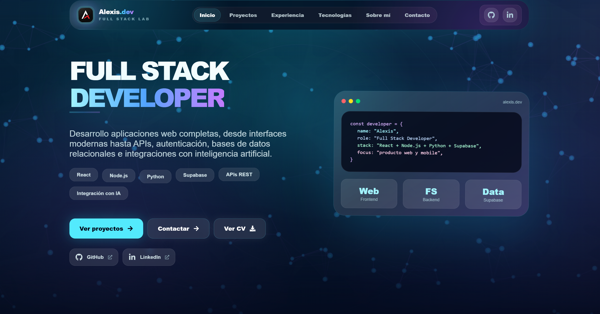

# Alexis Rodríguez — Full Stack Developer

[🇪🇸 Versión en español](./README.md)

Full Stack Developer focused on building complete web applications with **React, Node.js, Python and PostgreSQL**.

I work across the full stack: from responsive user interfaces to REST APIs, authentication, relational databases, external services and artificial intelligence integrations.

[](https://portafolio-alexis-chi.vercel.app/)
[](https://github.com/alexisrrh)

🌐 **[View Portfolio](https://portafolio-alexis-chi.vercel.app/)**

---



---

## 🚀 Featured Projects

### 🥗 NutriSmart Coach

Full Stack nutrition tracking application that uses **artificial intelligence to analyze food from images**, simplifying food logging and helping users track their nutrition over time.

**Stack**

<p>
  
  
  
  
  
  
  
</p>

**Technical highlights**

- AI-powered food analysis using Gemini.
- REST API developed with Node.js and Express.
- Authentication and data persistence with Supabase.
- Image processing and optimization before analysis.
- Nutrition history and tracking.
- Web-to-Android adaptation using Capacitor.
- Independent frontend and backend deployment.

**What this project demonstrates**

Full Stack architecture, artificial intelligence integration, image processing, authentication, relational data, API communication and cross-platform development.

➡️ **[View Case Study](https://portafolio-alexis-chi.vercel.app/projects/nutrismart-coach)**

---

### 🦷 LAC Dental Clinic

Management platform for a dental clinic designed around different workflows and permissions for **patients and healthcare professionals**.

**Stack**

<p>
  
  
  
  
  
</p>

**Technical highlights**

- Authentication and account recovery.
- Role-based access for patients and professionals.
- Protected routes based on permissions.
- Patient management.
- Appointment scheduling and availability validation.
- Clinical history management.
- Interactive odontogram.
- Budget and consent management.

**What this project demonstrates**

Role-based authorization, relational data modeling, protected application flows, complex forms and business logic.

➡️ **[View Case Study](https://portafolio-alexis-chi.vercel.app/projects/consultorio-lac)**

---

### 🎬 VHSFlix

Full Stack application for discovering audiovisual content, managing users and storing favorites through external API integrations.

**Stack**

<p>
  
  
  
  
  
  
</p>

**Technical highlights**

- REST API developed with Flask.
- JWT-based authentication.
- Data persistence using SQLAlchemy.
- Integration with TMDB and external services.
- Global state management with Context API and `useReducer`.
- User-based favorites system.

**What this project demonstrates**

Python backend development, REST APIs, authentication, ORM-based persistence, external API integration and React state management.

➡️ **[View Case Study](https://portafolio-alexis-chi.vercel.app/projects/vhsflix)**

---

## 🛠️ Tech Stack

### Frontend

<p>
  
  &nbsp;&nbsp;
  
  &nbsp;&nbsp;
  
  &nbsp;&nbsp;
  
  &nbsp;&nbsp;
  
  &nbsp;&nbsp;
  
</p>

### Backend

<p>
  
  &nbsp;&nbsp;
  
  &nbsp;&nbsp;
  
  &nbsp;&nbsp;
  
</p>

**REST APIs** · **JWT**

### Databases & Services

<p>
  
  &nbsp;&nbsp;
  
  &nbsp;&nbsp;
  
</p>

**Gemini AI** · **TMDB API**

### Tools & Deployment

<p>
  
  &nbsp;&nbsp;
  
  &nbsp;&nbsp;
  
  &nbsp;&nbsp;
  
  &nbsp;&nbsp;
  
</p>

**Render** · **Capacitor**

---

## 🧠 Technical Skills

Through my projects, I have worked with:

- Full Stack application architecture.
- Responsive interface development with React.
- REST API design and consumption.
- Authentication and role-based authorization.
- Relational data modeling and persistence.
- React state management.
- Protected routes and application flows.
- Forms and data validation.
- Third-party API and service integrations.
- Artificial intelligence integrations.
- Image processing and optimization.
- Full Stack application deployment.
- Debugging and problem solving.

---

## 🏗️ Portfolio Architecture

The portfolio follows a component-based architecture, keeping UI components, pages, routes, project data and visual assets separated.

```text
src/
├── assets/
├── components/
├── context/
├── data/
├── pages/
├── routes/
├── App.jsx
└── main.jsx
```

Project information and technical case study content are separated from visual components to improve maintainability, reusability and extensibility.

---

## 📚 Technical Case Studies

The three featured projects include detailed case studies covering:

- The problem being solved.
- The solution developed.
- My responsibilities.
- Application architecture.
- Technical decisions.
- Challenges encountered during development.
- Lessons learned.
- Potential improvements and roadmap.

The goal is to show not only **what I built**, but also **how I approached the technical decisions behind each project**.

➡️ **[Explore all projects](https://portafolio-alexis-chi.vercel.app/projects)**

---

## ⚙️ Local Setup

### 1. Clone the repository

```bash
git clone https://github.com/alexisrrh/portafolio.git
```

### 2. Enter the project

```bash
cd portafolio
```

### 3. Install dependencies

```bash
npm install
```

### 4. Start the development server

```bash
npm run dev
```

Vite will display the local development URL in the terminal.

---

## 📜 Available Scripts

| Command | Description |
| --- | --- |
| `npm run dev` | Starts the development server |
| `npm run build` | Creates the production build |
| `npm run lint` | Runs ESLint |
| `npm run preview` | Previews the production build locally |

---

## 🎯 Career Focus

I'm currently focused on continuing to grow as a **Full Stack Developer**, strengthening my knowledge of software architecture, testing, security, performance and development best practices.

I'm looking for opportunities where I can contribute my skills in **React and Full Stack development**, continue learning within a professional engineering team and participate in building real-world products.

---

## 📬 Contact

🌐 **Portfolio**  
[portafolio-alexis-chi.vercel.app](https://portafolio-alexis-chi.vercel.app/)

💻 **GitHub**  
[github.com/alexisrrh](https://github.com/alexisrrh)

---

<p align="center">
  Built with React + Vite · Deployed on Vercel
</p>
